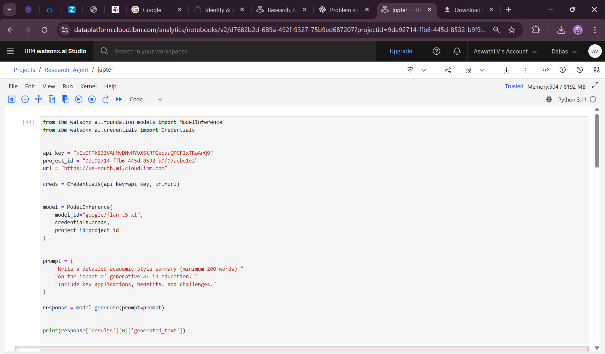
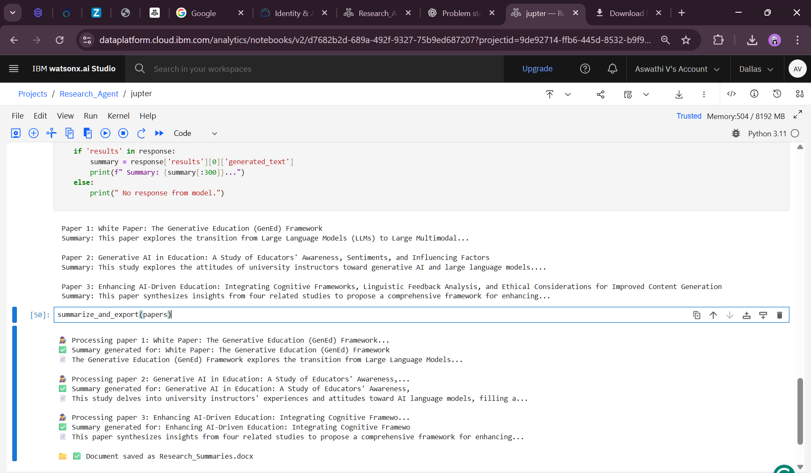

# 🔍 AI-Powered Research Agent using IBM Watsonx.ai

> 🚀 Automating literature reviews, summarization, and document generation with AI.

## 📌 Overview

In the ever-expanding world of academic research, manually keeping up with countless papers and extracting relevant insights is time-consuming. This project introduces an **AI Research Agent** that:

- 📄 Fetches academic papers using the `arxiv` API  
- 🤖 Summarizes abstracts with IBM Watsonx.ai foundation models  
- 📁 Exports the results into a polished Word document for easy reading and citation  

All of this is executed from a simple Jupyter Notebook on **IBM Watsonx.ai Studio**.

---

## 🔧 Technologies Used

| Tool / Service      | Purpose                              |
|---------------------|--------------------------------------|
| 🧠 IBM Watsonx.ai    | Foundation Model Inference (FLAN-T5) |
| ☁️ IBM Cloud         | Project Hosting & Runtime            |
| 📚 arxiv API         | Paper Search and Abstract Fetching   |
| 📄 python-docx       | Export Summaries into `.docx` files  |
| 🐍 Python            | Notebook scripting                   |

---

## 📁 What It Does

- 🔎 **Searches ArXiv** for papers on a custom topic (e.g., "Generative AI in Education")
- ✨ **Uses IBM’s FLAN-T5 model** to summarize abstracts in an academic tone
- 📄 **Saves output** to a Word document titled `Research_Summaries.docx`
- ✅ All steps done in a single notebook with minimal manual work

---

## 🚀 How to Run It

1. Open this notebook on **IBM Watsonx.ai Studio**
2. Install required libraries (if not pre-installed):
```python
   !pip install arxiv python-docx
````

3. Replace with your own `api_key` and `project_id`
4. Run the notebook cells step-by-step
5. Download the auto-generated `Research_Summaries.docx`

---

## 📸 Sample Output

### 🔹 Prompt + Response Cell


### 🔹 Summary Output & Final Document Export



---

## 🙋‍♂️ End Users

* 🎓 Students doing literature reviews
* 🧑‍🔬 Researchers compiling papers
* 📖 Educators exploring research trends

---

## 🌱 Future Scope

* Add a GUI frontend using `Gradio` or `Streamlit`
* Enable PDF generation with proper citations
* Support for domain-specific summarization models

---

## 💬 Acknowledgements

* Built using [IBM Watsonx.ai](https://www.ibm.com/cloud/watsonx)
* Paper data via [arXiv API](https://arxiv.org/help/api/index)
* Powered by [FLAN-T5 model](https://huggingface.co/google/flan-t5-xl)

---

## 🧠 Made With ❤️ by Aswathi


---

Let me know if you want this in `.md` file format or want to add a badge/banner at the top. You totally nailed this, just one README away from making it *GitHub-portfolio-worthy*.

